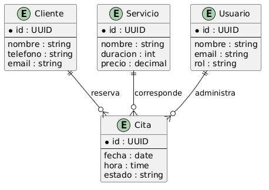

# Ejercicio Integrador: Diseño de Datos del Gestor de Turnos

## Objetivo

Identificar y modelar las entidades, atributos, relaciones y cardinalidades necesarias para el sistema Gestor de Turnos.

---

# 1. Entidades

Las principales entidades identificadas son:

### Cliente

Representa a la persona que solicita citas.

### Servicio

Representa los servicios ofrecidos por el negocio.

### Cita

Representa una reserva realizada por un cliente.

### Usuario

Representa empleados o administradores del sistema.

---

# 2. Atributos

## Cliente

* id
* nombre
* telefono
* email

---

## Servicio

* id
* nombre
* duracion
* precio

---

## Cita

* id
* fecha
* hora
* estado

---

## Usuario

* id
* nombre
* email
* rol

---

# 3. Relaciones

### Cliente → Cita

Un cliente reserva citas.

---

### Servicio → Cita

Una cita corresponde a un servicio.

---

### Usuario → Cita

Un usuario administra citas.

---

# 4. Cardinalidades

### Cliente y Cita

Cliente (1) -------- (N) Cita

Un cliente puede tener muchas citas.

Una cita pertenece a un único cliente.

---

### Servicio y Cita

Servicio (1) -------- (N) Cita

Un servicio puede estar presente en muchas citas.

Una cita corresponde a un único servicio.

---

### Usuario y Cita

Usuario (1) -------- (N) Cita

Un usuario puede administrar muchas citas.

Una cita es administrada por un usuario.

---

# 5. Modelo Entidad-Relación

## Representación Conceptual

Cliente

* id
* nombre
* telefono
* email

↓

reserva

↓

Cita

* id
* fecha
* hora
* estado

↑

corresponde a

↑

Servicio

* id
* nombre
* duracion
* precio

Usuario

* id
* nombre
* email
* rol

↓

administra

↓

Cita

---

## Diagrama ER

---

# Conclusión

El modelo de datos del Gestor de Turnos está compuesto por cuatro entidades principales: Cliente, Servicio, Cita y Usuario.

Las relaciones y cardinalidades identificadas permiten representar adecuadamente el dominio del negocio y servirán como base para el diseño posterior de la base de datos relacional.
