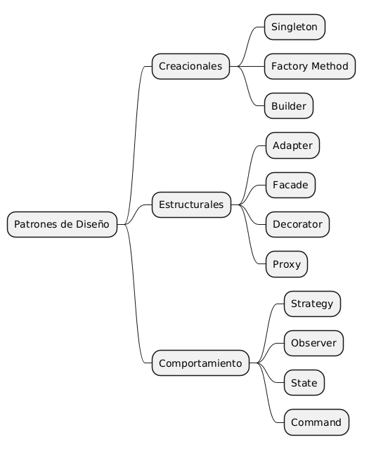

# Patrones de Diseño Básicos

## Definición

Los patrones de diseño son soluciones reutilizables a problemas comunes que aparecen durante el diseño de software.

No son algoritmos ni fragmentos de código que puedan copiarse directamente, sino plantillas o modelos que pueden adaptarse a diferentes situaciones.

Su objetivo es ayudar a construir software más flexible, mantenible y reutilizable.

---

## Origen de los Patrones de Diseño

Los patrones de diseño fueron popularizados en 1994 por Erich Gamma, Richard Helm, Ralph Johnson y John Vlissides, conocidos como la "Gang of Four" (GoF).

En su libro *Design Patterns: Elements of Reusable Object-Oriented Software* documentaron 23 patrones de diseño orientados a objetos que hoy constituyen la base del diseño de software moderno.

Estos patrones no representan código listo para usar, sino soluciones reutilizables a problemas frecuentes de diseño.

---

## Importancia

Los patrones de diseño permiten:

* Resolver problemas comunes de diseño.
* Reutilizar soluciones probadas.
* Reducir el acoplamiento.
* Incrementar la flexibilidad del software.
* Facilitar la comunicación entre desarrolladores mediante un lenguaje común.

Los patrones de diseño generalmente buscan:

- Reducir el acoplamiento.
- Incrementar la cohesión.
- Favorecer la reutilización.
- Facilitar la extensión del software.
- Hacer el código más flexible ante cambios.
---

## Clasificación

Los patrones de diseño se agrupan en tres categorías principales.

### Patrones Creacionales

Se enfocan en la creación de objetos de forma flexible.

Ejemplos:

* Singleton
* Factory Method
* Builder

---

### Patrones Estructurales

Describen cómo organizar clases y objetos para formar estructuras más grandes.

Ejemplos:

* Adapter
* Facade
* Decorator
* Proxy

---

### Patrones de Comportamiento

Describen cómo colaboran los objetos y cómo se distribuyen las responsabilidades.

Ejemplos:

* Strategy
* Observer
* State
* Command

---

## Lo que resuelven

### Patrones Creacionales

* Cómo se crean los objetos.

### Patrones Estructurales

* Cómo se relacionan los objetos.

### Patrones de Comportamiento

* Cómo se comportan los objetos.

## Explicación Feynman

Imagina que un arquitecto debe construir una casa.

No comienza desde cero cada vez.

Utiliza planos y soluciones que ya han demostrado funcionar para escaleras, techos, puertas y ventanas.

Los patrones de diseño cumplen el mismo propósito en el desarrollo de software.

No indican exactamente cómo escribir el código, sino una forma de organizarlo para resolver problemas frecuentes.

---

## Ejemplos en el Gestor de Turnos

### Repository

Permite separar la lógica de acceso a datos de la lógica del negocio.

Ejemplo:

AppointmentRepository

Se encarga únicamente de consultar y almacenar información en la base de datos.

---

### Strategy

Permite cambiar un algoritmo sin modificar el resto del sistema.

Ejemplo:

Notificaciones:

* Email.
* SMS.
* WhatsApp.

Cada tipo de notificación implementa una estrategia distinta.

---

### State

Representa los diferentes estados de una entidad.

Ejemplo:

Cita

* Pendiente.
* Confirmada.
* Cancelada.
* Completada.

---

### Factory Method

Permite crear objetos sin depender directamente de clases concretas.

Ejemplo:

Crear distintos tipos de usuarios:

* Cliente.
* Empleado.
* Administrador.

---

## Relación con SOLID

Muchos patrones de diseño utilizan principios SOLID para lograr soluciones más flexibles.

Por ejemplo:

* Strategy aplica el principio Open/Closed.
* Repository favorece la Inversión de Dependencias.
* State ayuda a reducir condicionales complejos.

Por esta razón, comprender SOLID facilita el aprendizaje de los patrones de diseño.

---

## Relación con el Desarrollo Backend

En aplicaciones backend modernas es habitual utilizar patrones como:

* Repository.
* Strategy.
* Factory.
* Singleton.

Estos patrones ayudan a construir aplicaciones más organizadas, escalables y fáciles de mantener.

## UML de Patrones de Diseño

