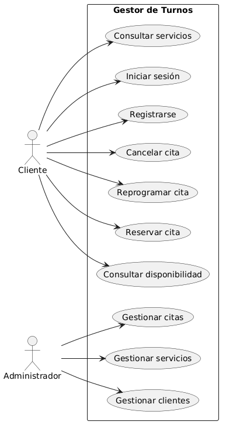
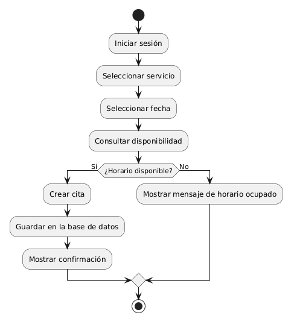
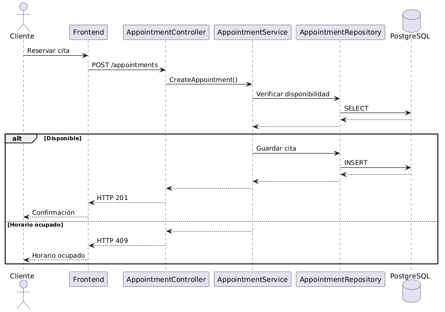
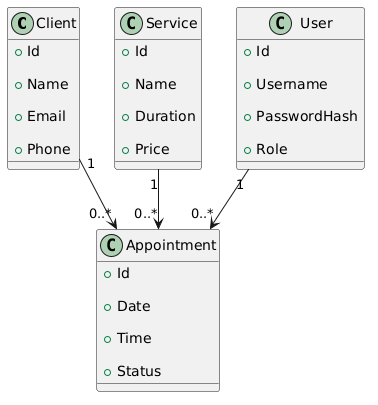
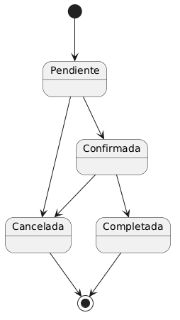

# Ejercicio Integrador: Documentación del Gestor de Turnos

## Objetivo

El objetivo de este ejercicio es organizar la documentación del Gestor de Turnos utilizando los principales documentos estudiados durante esta sección.

Cada documento está dirigido a un público diferente y cumple una función específica dentro del ciclo de vida del software.

---

# Proyecto

**Nombre:** Gestor de Turnos

## Descripción

El Gestor de Turnos es una aplicación web que permite administrar clientes, servicios y citas para una barbería.

El sistema facilita la reserva, modificación y cancelación de citas, además de permitir la gestión de clientes y servicios por parte de los administradores.

---

# 1. Especificación de Requisitos (SRS)

## Propósito

Definir claramente qué debe hacer el sistema antes de comenzar el desarrollo.

## Información incluida

### Problema

La barbería administra las citas manualmente, generando conflictos de horarios, pérdida de información y una mala experiencia para los clientes.

### Objetivo

Desarrollar una aplicación que permita gestionar las citas de forma organizada y eficiente.

### Actores

* Cliente
* Empleado
* Administrador

### Requisitos Funcionales

* Registrar clientes.
* Registrar servicios.
* Reservar citas.
* Cancelar citas.
* Reprogramar citas.
* Consultar disponibilidad.

### Requisitos No Funcionales

* Tiempo de respuesta inferior a 2 segundos.
* Comunicación mediante HTTPS.
* Contraseñas almacenadas mediante hash.
* Disponibilidad del sistema superior al 99%.

### Restricciones

* Backend desarrollado en ASP.NET Core.
* Base de datos PostgreSQL.
* Arquitectura Cliente-Servidor.
* API REST.

---

# 2. Diagramas UML

## Diagrama de Casos de Uso



---

## Diagrama de Actividad



---

## Diagrama de Secuencia



---

## Diagrama de Clases



---

## Diagrama de Estados



---

# 3. Documentación Técnica

Describe cómo está construido el sistema.

## Arquitectura

* Cliente-Servidor.
* Monolito.
* API REST.

## Tecnologías

* ASP.NET Core
* PostgreSQL
* Entity Framework Core
* JWT
* Swagger

## Base de Datos

Tablas principales:

* Clients
* Users
* Services
* Appointments

## Estructura del Proyecto

```text
AppointmentManager/

├── Controllers/

├── Services/

├── Repositories/

├── Models/

├── DTOs/

├── Database/

└── Program.cs
```

## API

Principales endpoints:

```http
GET /appointments

POST /appointments

PATCH /appointments/{id}

DELETE /appointments/{id}
```

---

# 4. Manual de Usuario

Documento dirigido al usuario final.

## Funcionalidades

### Registrarse

Permite crear una nueva cuenta.

### Iniciar sesión

Permite acceder al sistema.

### Reservar una cita

1. Seleccionar el servicio.
2. Elegir fecha.
3. Seleccionar un horario disponible.
4. Confirmar la reserva.

### Reprogramar una cita

Permite modificar la fecha y hora de una cita existente.

### Cancelar una cita

Permite cancelar una cita antes de ser atendida.

### Consultar disponibilidad

Muestra los horarios libres para cada servicio.

---

# 5. Manual de Operación

Documento dirigido al administrador del sistema.

## Instalación

* Clonar el repositorio.
* Restaurar dependencias.
* Configurar PostgreSQL.
* Ejecutar migraciones.
* Iniciar la aplicación.

## Configuración

* Variables de entorno.
* appsettings.json.
* Cadena de conexión.
* JWT Secret.

## Mantenimiento

* Realizar copias de seguridad.
* Restaurar respaldos cuando sea necesario.
* Supervisar los logs del sistema.
* Verificar el consumo de recursos.

## Actualizaciones

1. Crear respaldo.
2. Descargar nueva versión.
3. Ejecutar migraciones.
4. Reiniciar la aplicación.
5. Verificar el correcto funcionamiento.

---

# Organización de la Documentación

```text
Gestor de Turnos

│

├── Especificación de Requisitos

│

├── Diagramas UML

│

├── Documentación Técnica

│

├── Manual de Usuario

│

└── Manual de Operación
```

Cada documento responde a necesidades específicas y está dirigido a un público diferente.

---

# Relación con toda la Ruta

La documentación presentada resume el proceso completo de análisis y diseño del Gestor de Turnos.

Para construir estos documentos fue necesario aplicar los conocimientos adquiridos en:

* Fundamentos.
* Análisis de Requisitos.
* Modelado del Negocio.
* UML.
* Diseño de Datos.
* Diseño de Software.
* Diseño de Bases de Datos.
* Diseño de Arquitectura.
* Calidad del Software.

Cada etapa aportó información que posteriormente fue organizada y documentada.

---

# Conclusión

La documentación constituye el resultado final del proceso de análisis y diseño del Gestor de Turnos.

Cada documento cumple una función específica:

* La **Especificación de Requisitos** define qué debe hacer el sistema.
* Los **Diagramas UML** representan visualmente su estructura y comportamiento.
* La **Documentación Técnica** explica cómo está construido.
* El **Manual de Usuario** enseña a utilizar la aplicación.
* El **Manual de Operación** describe cómo instalarla, administrarla y mantenerla.

En conjunto, estos documentos permiten que analistas, desarrolladores, administradores y usuarios comprendan y utilicen el sistema de manera adecuada durante todo su ciclo de vida.
