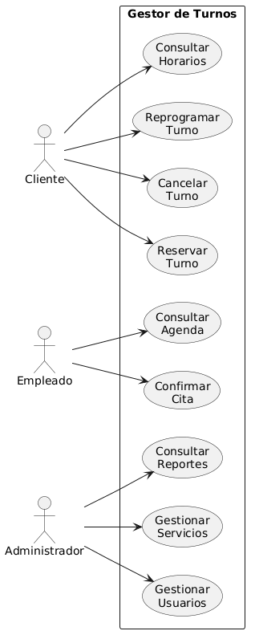

# Diagramas de Casos de Uso

## Definición

Un diagrama de casos de uso es un tipo de diagrama UML que representa las funcionalidades que ofrece un sistema y los actores que interactúan con ellas.

Su objetivo es mostrar qué puede hacer cada actor dentro del sistema sin entrar en detalles de implementación.

---

## Elementos Principales

### Actor

Entidad externa que interactúa con el sistema.

Puede ser:

* Persona.
* Sistema externo.
* Dispositivo.

---

### Caso de Uso

Funcionalidad ofrecida por el sistema.

Ejemplos:

* Reservar Turno.
* Cancelar Turno.
* Consultar Horarios.

---

### Sistema

Representado mediante un rectángulo que contiene los casos de uso.

---

### Relaciones

Líneas que conectan actores con casos de uso.

Representan interacción.

---

## Explicación Feynman

Un diagrama de casos de uso es un mapa de funcionalidades.

Nos permite responder:

* ¿Quién usa el sistema?
* ¿Qué puede hacer cada usuario?

No muestra bases de datos ni código.

Solo muestra las capacidades que ofrece el sistema.

---

## Ejemplo: Gestor de Turnos

Actores:

* Cliente.
* Empleado.
* Administrador.

Casos de Uso:

* Reservar Turno.
* Cancelar Turno.
* Consultar Horarios.
* Consultar Agenda.
* Gestionar Usuarios.
* Gestionar Servicios.

### Diagrama

---

## Relación con el Análisis de Requisitos

Los diagramas de casos de uso se construyen a partir de:

* Actores.
* Requisitos funcionales.
* Casos de uso identificados durante el análisis.

Por esta razón suelen ser el primer diagrama UML desarrollado en un proyecto.
