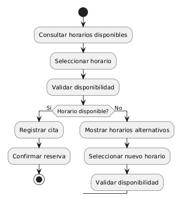

# Diagramas de Actividad

## Definición

Un diagrama de actividad es un tipo de diagrama UML que representa el flujo de actividades, decisiones y acciones necesarias para completar un proceso o caso de uso.

Su objetivo es mostrar cómo se ejecuta una tarea paso a paso, incluyendo posibles bifurcaciones, condiciones y caminos alternativos.

---

## Importancia

Los diagramas de actividad permiten:

* Visualizar procesos de negocio.
* Comprender flujos de trabajo.
* Identificar decisiones importantes.
* Detectar actividades innecesarias.
* Comunicar procesos de forma clara.

---

## Elementos Principales

### Nodo Inicial

Representa el inicio del flujo.

### Actividad

Representa una tarea o acción.

### Decisión

Representa una condición que genera caminos alternativos.

### Flujo

Representa la dirección del proceso.

### Nodo Final

Representa el fin del proceso.

---

## Explicación Feynman

Un diagrama de actividad es como un mapa de instrucciones.

Muestra:

* Qué ocurre primero.
* Qué ocurre después.
* Qué decisiones deben tomarse.
* Qué caminos alternativos pueden existir.
* Cómo termina el proceso.

Es similar a un diagrama de flujo tradicional.

---

## Ejemplo: Gestor de Turnos

### Caso de Uso

Reservar Turno.

### Flujo

1. Cliente consulta horarios.
2. Cliente selecciona un horario.
3. Sistema valida disponibilidad.
4. ¿Horario disponible?
5. Si está disponible, registrar cita.
6. Confirmar reserva.
7. Fin.

Si no está disponible:

1. Mostrar horarios alternativos.
2. Volver a seleccionar horario.

### Diagrama

---

## Relación con los Casos de Uso

Los diagramas de actividad suelen construirse a partir de los casos de uso.

Caso de Uso:

* Reservar Turno.

Diagrama de Actividad:

* Describe paso a paso cómo se ejecuta dicha funcionalidad.

---

## Diferencia con Diagramas de Casos de Uso

### Casos de Uso

Muestran:

* Quién utiliza el sistema.
* Qué funcionalidades existen.

### Actividad

Muestra:

* Cómo se ejecuta una funcionalidad paso a paso.

Los diagramas de actividad tienen mayor nivel de detalle.
