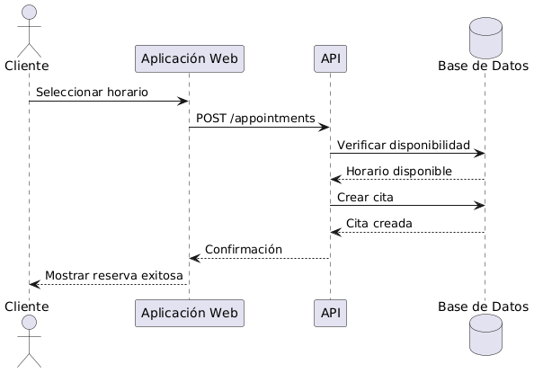

# Diagramas de Secuencia

## Definición

Un diagrama de secuencia es un tipo de diagrama UML que representa la interacción entre actores, objetos o sistemas a lo largo del tiempo.

Su objetivo es mostrar el orden en que se intercambian mensajes para completar una funcionalidad o caso de uso.

---

## Importancia

Los diagramas de secuencia permiten:

* Comprender cómo colaboran los componentes del sistema.
* Visualizar el flujo de mensajes.
* Modelar la lógica de una funcionalidad.
* Identificar responsabilidades de cada componente.
* Servir como guía para la implementación.

---

## Elementos Principales

### Actor

Entidad externa que inicia la interacción.

Ejemplo:

* Cliente.
* Empleado.

---

### Participante

Objeto, componente o sistema que interviene en el proceso.

Ejemplos:

* Frontend.
* API.
* Base de Datos.

---

### Línea de Vida

Representa la existencia de un participante durante la interacción.

Se dibuja como una línea vertical.

---

### Mensaje

Comunicación entre participantes.

Ejemplo:

* Consultar horarios.
* Registrar cita.
* Validar disponibilidad.

---

## Explicación Feynman

Un diagrama de secuencia es como observar una conversación.

No solo importa quién participa.

También importa:

* Quién habla primero.
* Quién responde.
* En qué orden ocurre todo.

Por eso los diagramas de secuencia muestran la cronología exacta de una interacción.

---

## Ejemplo: Gestor de Turnos

### Caso de Uso

Reservar Turno.

### Participantes

* Cliente.
* Aplicación Web.
* API.
* Base de Datos.

### Secuencia

1. El cliente selecciona un horario.
2. La aplicación envía la solicitud a la API.
3. La API consulta la disponibilidad.
4. La base de datos responde.
5. La API registra la cita.
6. La base de datos confirma el registro.
7. La API responde a la aplicación.
8. La aplicación muestra la confirmación al cliente.

### Diagrama

---

## Relación con Diagramas de Actividad

### Diagrama de Actividad

Muestra:

* Las actividades del proceso.

### Diagrama de Secuencia

Muestra:

* Los participantes.
* Los mensajes intercambiados.
* El orden temporal.

Ambos describen el mismo proceso desde perspectivas distintas.

---

## Relación con el Desarrollo de Software

Los diagramas de secuencia son especialmente útiles para diseñar:

* APIs.
* Servicios.
* Controladores.
* Bases de datos.
* Integraciones entre sistemas.

Por esta razón suelen utilizarse antes de la implementación.
