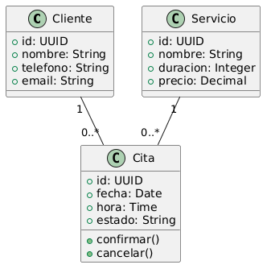

# Diagramas de Clases

## Definición

Un diagrama de clases es un tipo de diagrama UML que representa las clases de un sistema, sus atributos, métodos y las relaciones existentes entre ellas.

Su objetivo es modelar la estructura estática del sistema antes de la implementación.

Los diagramas de clases son ampliamente utilizados durante el análisis y diseño orientado a objetos.

---

## Importancia

Los diagramas de clases permiten:

* Identificar entidades del dominio.
* Definir atributos y comportamientos.
* Modelar relaciones entre objetos.
* Servir como base para el diseño de bases de datos.
* Facilitar la implementación del software.

---

## Elementos Principales

### Clase

Representa un objeto o concepto del sistema.

Ejemplos:

* Cliente.
* Cita.
* Servicio.
* Usuario.

---

### Atributos

Representan las características de una clase.

Ejemplo:

Cliente

* id
* nombre
* telefono

---

### Métodos

Representan las acciones que puede realizar una clase.

Ejemplo:

Cita

* cancelar()
* confirmar()

---

### Relaciones

Permiten conectar clases entre sí.

Las más comunes son:

* Asociación.
* Agregación.
* Composición.
* Herencia.

---

## Explicación Feynman

Un diagrama de clases es como el plano de un edificio.

Antes de construir una casa:

* Se dibujan habitaciones.
* Se definen puertas.
* Se establecen conexiones.

En software ocurre lo mismo.

Antes de escribir código se identifican las entidades y cómo se relacionan.

---

## Ejemplo: Gestor de Turnos

### Clases Principales

#### Cliente

Atributos:

* id
* nombre
* telefono
* email

---

#### Servicio

Atributos:

* id
* nombre
* duracion
* precio

---

#### Cita

Atributos:

* id
* fecha
* hora
* estado

Métodos:

* confirmar()
* cancelar()

---

### Relaciones

Un Cliente puede tener muchas Citas.

Una Cita pertenece a un único Cliente.

Un Servicio puede estar asociado a muchas Citas.

Una Cita corresponde a un único Servicio.

---

## Relación con Bases de Datos (Diagrama)

Las clases suelen transformarse posteriormente en tablas.

Por esta razón los diagramas de clases suelen ser un paso previo al diseño de bases de datos.

## Relación con la Programación

Los diagramas de clases sirven como guía para crear:

* Clases.
* Interfaces.
* Entidades.
* Modelos de dominio.

En proyectos orientados a objetos existe una relación muy cercana entre el diagrama y el código final.

---

## Diferencia con Diagramas de Secuencia

### Diagrama de Clases

Muestra:

* Estructura.
* Entidades.
* Relaciones.

### Diagrama de Secuencia

Muestra:

* Interacciones.
* Mensajes.
* Orden temporal.

Uno modela la estructura.

El otro modela el comportamiento.
