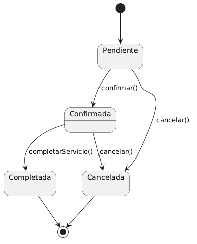

# Diagramas de Estados

## Definición

Un diagrama de estados es un tipo de diagrama UML que representa los distintos estados por los que puede pasar una entidad durante su ciclo de vida y las transiciones que provocan los cambios entre dichos estados.

Su objetivo es modelar el comportamiento dinámico de objetos que cambian de estado a lo largo del tiempo.

---

## Importancia

Los diagramas de estados permiten:

* Comprender el ciclo de vida de una entidad.
* Visualizar cambios de estado.
* Identificar eventos que provocan transiciones.
* Validar reglas de negocio.
* Facilitar la implementación de lógica de estados.

---

## Elementos Principales

### Estado

Representa una situación o condición de una entidad.

Ejemplos:

* Pendiente.
* Confirmada.
* Cancelada.
* Completada.

---

### Transición

Representa el cambio entre estados.

Ejemplo:

Pendiente → Confirmada

---

### Evento

Acción que provoca una transición.

Ejemplos:

* Confirmar cita.
* Cancelar cita.
* Finalizar servicio.

---

### Estado Inicial

Indica dónde comienza el ciclo de vida.

---

### Estado Final

Indica dónde termina el ciclo de vida.

---

## Explicación Feynman

Imagina una pizza cuando la pides.

Puede estar:

* Pendiente.
* En preparación.
* En camino.
* Entregada.

La pizza no puede estar en todos los estados al mismo tiempo.

Va cambiando de uno a otro conforme ocurren eventos.

En software sucede exactamente lo mismo.

---

## Ejemplo: Gestor de Turnos

### Entidad

Cita.

### Estados

* Pendiente.
* Confirmada.
* Completada.
* Cancelada.

### Eventos

* Confirmar cita.
* Completar servicio.
* Cancelar cita.

### Flujo

Pendiente

↓

Confirmada

↓

Completada

o

Pendiente

↓

Cancelada

---

## Diagrama

## Relación con las Reglas de Negocio

Los diagramas de estados suelen estar gobernados por reglas de negocio.

Ejemplo:

* Una cita completada no puede volver a estar pendiente.
* Una cita cancelada no puede confirmarse posteriormente.

Estas reglas limitan las transiciones válidas.

---

## Relación con la Programación

Los diagramas de estados suelen convertirse en:

* Enumeraciones (Enums).
* Máquinas de estado.
* Validaciones de negocio.

Ejemplo:

Estado de cita:

* PENDING
* CONFIRMED
* COMPLETED
* CANCELLED

El sistema valida qué transiciones son permitidas.

---

## Diferencia con Diagramas de Actividad

### Diagrama de Actividad

Describe actividades y procesos.

Ejemplo:

* Reservar turno.
* Validar disponibilidad.
* Confirmar reserva.

### Diagrama de Estados

Describe la evolución de una entidad.

Ejemplo:

* Pendiente.
* Confirmada.
* Completada.

Uno modela procesos.

El otro modela estados.
